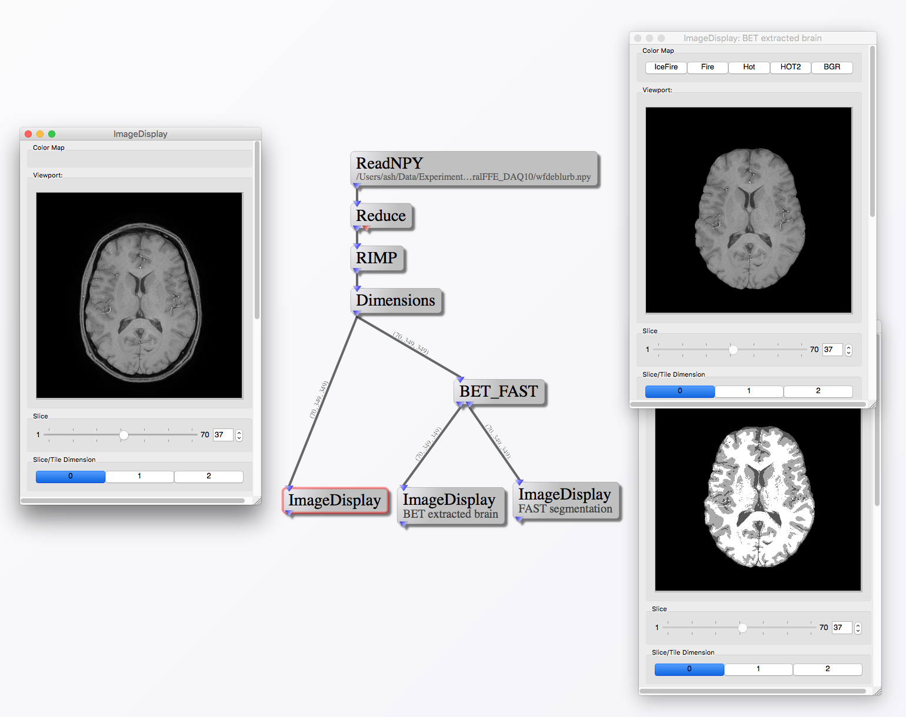

# gpi-neurotools

This repository contains wrappers for working with popular neuroimaging tools (e.g. FSL) and reading/writing popular file formats (e.g. NIfTI) in [GPI](https://github.com/gpilab/framework).

# Installation
Follow the instructions in [this article](http://gpilab.com/2015/06/installing-node-libraries/) for installing new node libraries in GPI.

# Dependencies
* [GPI Framework](https://github.com/gpilab/framework) version 1.0.0 or newer (must have the [BORG](http://gpilab.com/2016/02/gpi-and-the-bart/))
* [NIBabel](http://nipy.org/nibabel/) - Python libraries for reading and writing common neuroimaging file formats
  * `pip install nibabel` - make sure you use the `pip` associated with GPI's Python
* [FSL](http://fsl.fmrib.ox.ac.uk/fsl/fslwiki/) - FNIRB Software Library
  * Follow the [installation instructions](http://fsl.fmrib.ox.ac.uk/fsl/fslwiki/FslInstallation#Installing_FSL) on the FSL website, such that `flirt`, `bet`, and `fast` are in your `PATH`
